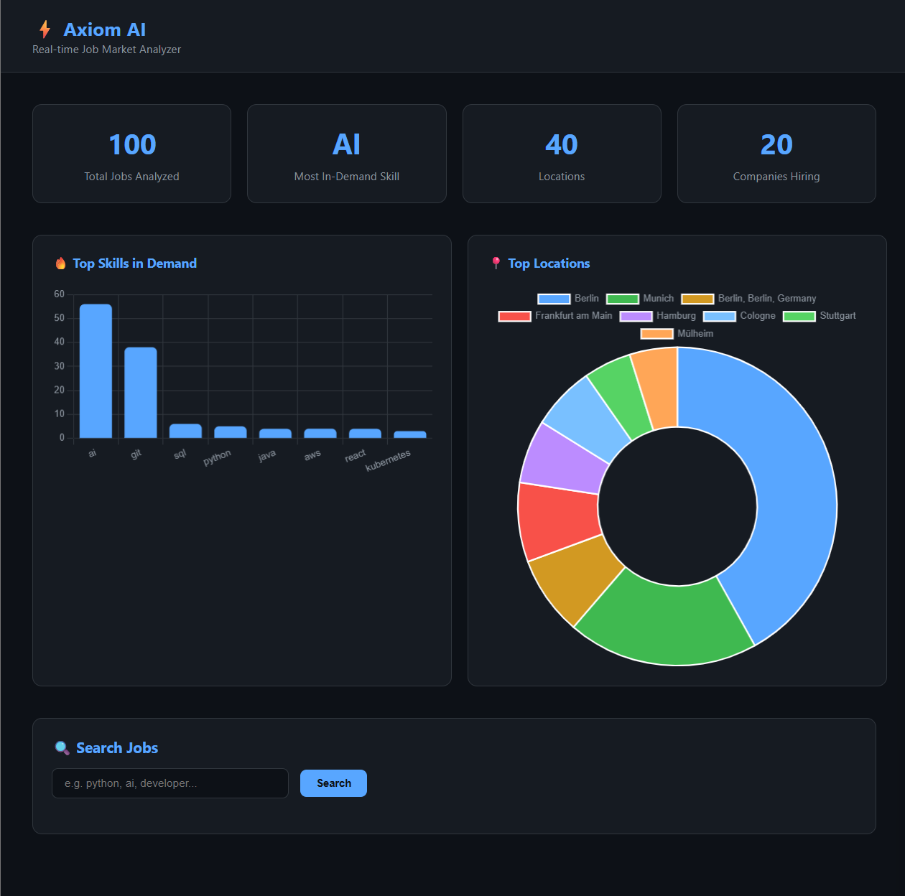

# ⚡ Axiom AI — Job Market Analyzer

> Real-time AI-powered job market analyzer built with FastAPI, SQLite and Python

## 📸 Dashboard Preview


---

## 🚀 What It Does
- Fetches 100+ real job listings from live API
- Stores data in SQLite database
- Analyzes most in-demand skills across all jobs
- Shows top hiring companies and locations
- Search jobs by keyword
- Beautiful dark dashboard with interactive charts
- REST API with interactive documentation

---

## 🛠 Tech Stack


---

## 📡 API Endpoints

| Method | Endpoint | Description |
|---|---|---|
| GET | `/` | Root — API info |
| GET | `/jobs` | Get all jobs |
| GET | `/jobs/count` | Total job count |
| GET | `/jobs/locations` | Jobs by location |
| GET | `/jobs/skills` | Top skills in demand |
| GET | `/jobs/companies` | Top hiring companies |
| GET | `/jobs/titles` | Most common job titles |
| GET | `/jobs/search/{keyword}` | Search jobs by keyword |
| GET | `/dashboard` | Live visual dashboard |

---

## ⚙️ How to Run
```bash
# Clone the repo
git clone https://github.com/mostafa-raihan/axiom_ai.git
cd axiom_ai

# Create virtual environment
python3 -m venv venv
source venv/bin/activate

# Install dependencies
pip install -r requirements.txt

# Setup database
python3 app/database.py

# Fetch jobs
python3 app/fetcher.py

# Run the API
uvicorn app.main:app --reload
```

Then visit:
- **Dashboard:** http://127.0.0.1:8000/dashboard
- **API Docs:** http://127.0.0.1:8000/docs

---

## 📖 Project Structure
```
axiom_ai/
├── app/
│   ├── main.py        # FastAPI endpoints
│   ├── database.py    # SQLite setup
│   └── fetcher.py     # Job data fetcher
├── templates/
│   └── index.html     # Dashboard UI
├── requirements.txt
└── README.md
```

---

## 👨‍💻 Author
**Mostafa Raihan** — AI & Data Engineering Student @ SAMK  
🌍 Tampere, Finland | 📫 mostafaraihan26@gmail.com